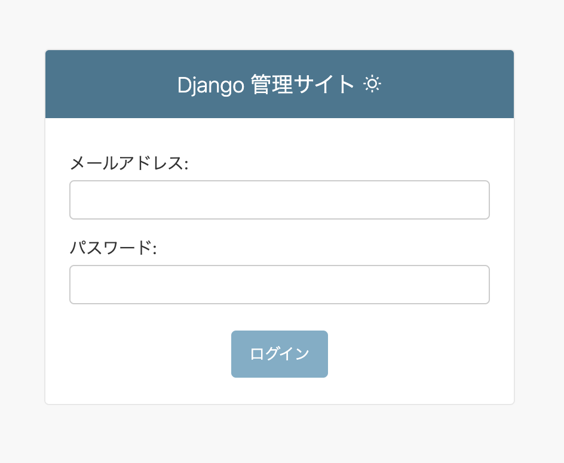
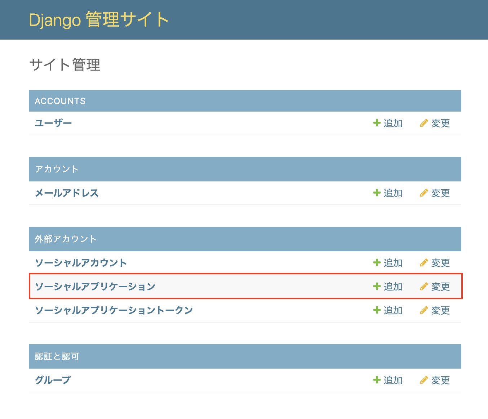
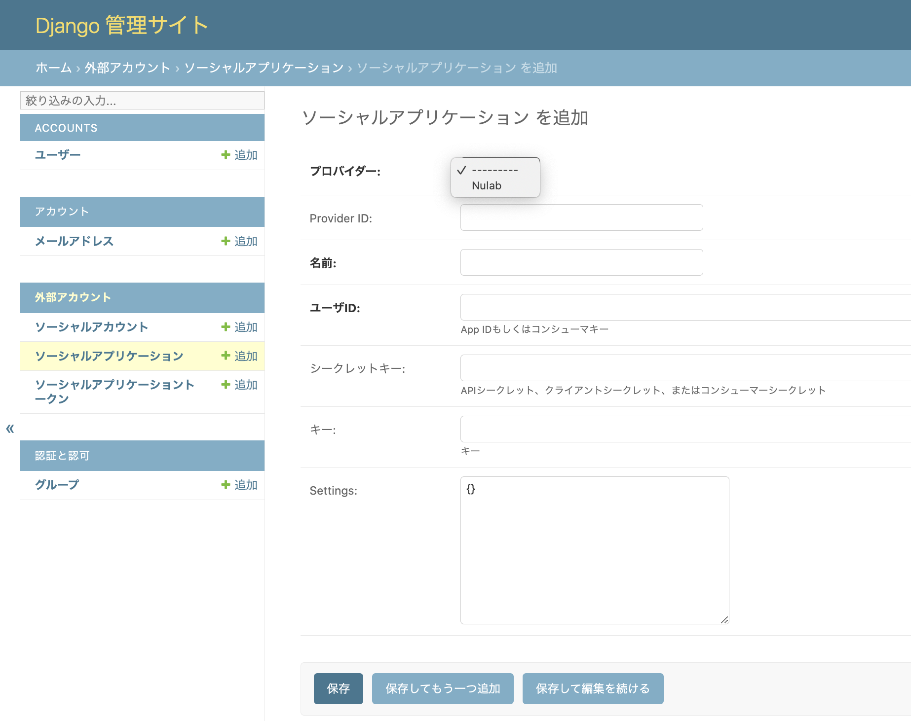
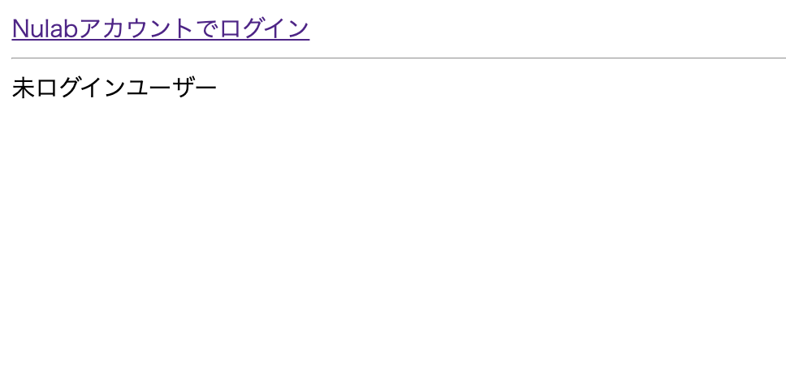
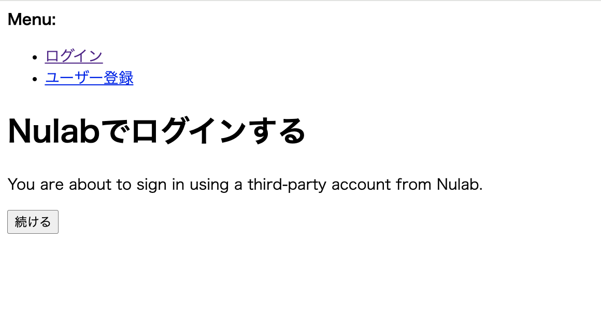

# ヌーラボアカウントを利用したソーシャルログイン機能

# 開発環境構築

## DBの構築
サービスを起動する
```
$ docker-compose up -d db
```
コンテナ内でコマンドを実行し、DBを作成する。
```
$ createdb -U postgres -E UTF-8 exam
```
作成されていることを確認する
```
$ psql -U postgres -l
```

## .envを作成
manage.pyと同じ階層に.envファイルを作成し、情報を追加する  
`SECRET_KEY`は環境ごとに異なる値を設定する。  
```
SECRET_KEY=XXXXXXXXXXXXXXXXXXXXXX
ALLOWED_HOSTS=
POSTGRES_PASSWORD=
DB_NAME=
DB_USER=
DB_PASSWORD=
DB_PORT=
DB_HOST=
DEBUG=
SERVER_URL_PREFIX=
```
## 管理者ユーザーを作成する
サービスを再起動する
```
$ docker-compose up -d
```
appコンテナ内でコマンドを実行する  
※作成した管理者ユーザーはOAuthプロバイダの設定時に使用します
```
$ python manage.py createsuperuser
ユーザー名、Eメールアドレス、パスワードを入力すると「Superuser created successfully」と表示されます。
```

## OAuthプロバイダの設定をする
#### プロバイダの設定ページにアクセスするために、管理者ユーザーでAdmin サイトにログインする

http://localhost:8000/admin/login/



#### メニューの`ソーシャルアプリケーション`の追加を選択する  



#### 各項目に値を入力し、保存する

| 項目名      | 値               |
|----------|-----------------|
| プロバイダー   | Nulab           |
| 名前       | app（任意の名前)      |
| ユーザID    | client_id ※     |
| シークレットキー | client_secret ※ |
※ここで使用するclient_idとclient_secretを取得するには、[Backlog Developer サイト](https://backlog.com/developer/applications/)でアプリケーション登録が必須  



# nulabアカウントでログインする
サービスを起動する
```
$ docker-compose up -d
```
ブラウザからログイン画面を開き、`nulabアカウントでログイン`をクリックする  
http://localhost:8000  


`続ける`をクリックすると、ヌーラボアカウントの認証画面に遷移する  

